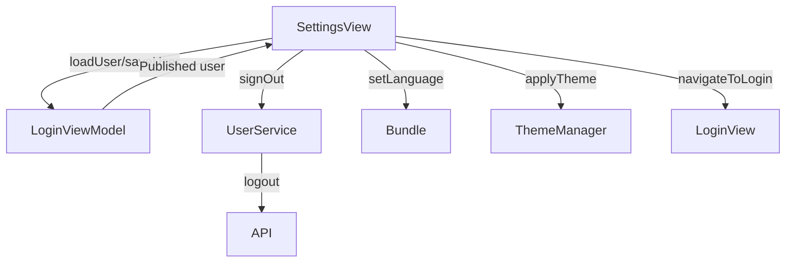

# Settings Screen

## UI Components

* `NavigationStack`: Manages navigation for the screen.
* `TopBar`: Displays the app title ("Keyz").
* `Form`: Organizes settings into sections for user information, language, theme, and logout.
* `Image`: Displays a user icon (`person.crop.circle.fill`).
* `CustomTextInput`: Fields for first name, last name, and email (editable when `isEditing` is true).
* `Picker`: 
  * Segmented picker for selecting language (French or English).
  * Segmented picker for selecting theme (System, Light, Dark).
* `Button`: Logout button to sign out the user.
* Note: Edit and Cancel/Confirm buttons are commented out but referenced in the code for toggling edit mode.

---

## ViewModel

### `LoginViewModel`
* Manages:
  * `user`: Stores user data (`id`, `role`, `email`, `firstname`, `lastname`).
  * `userId`: Stores the user's ID.
  * `userRole`: Stores the user's role (e.g., "tenant" or "owner").
* Functions:
  * `loadUser()`: Loads user data from storage or API.
  * `saveUser(_:)`: Saves updated user information.

### Other Dependencies
* `UserService`: Handles logout operations.
* `TokenStorage`: Manages authentication tokens.
* `Bundle`: Manages language settings.
* `ThemeManager`: Applies theme settings.

### State Observed
* `@AppStorage`:
  * `lang`: Stores the selected language ("en" or "fr").
  * `selectedTheme`: Stores the selected theme ("System", "Light", "Dark").
  * `isLoggedIn`: Tracks login status.
* `@State`:
  * `navigateToLogin`: Triggers navigation to the login screen after logout.
  * `editableEmail`, `editableFirstname`, `editableLastname`: Editable user fields.
  * `isEditing`: Toggles edit mode for user information.

---

## Functionality

* Displays user settings with:
  * User information: First name, last name, email (editable when `isEditing` is true).
  * Language selection: French or English, updates via `Bundle.setLanguage(_:)`.
  * Theme selection: System, Light, or Dark, applied via `ThemeManager.applyTheme(_:)`.
  * Logout button: Signs out the user and navigates to the login screen.
* User information:
  * Loads data from `loginViewModel.user` on appear and when `user.email` changes.
  * Commented-out functionality allows editing and saving changes to user data (`saveChanges()` and `resetFields()`).
* Logout:
  * Calls `UserService.shared.logout()` and clears tokens via `TokenStorage.clearTokens()`.
  * Resets `isLoggedIn`, `user`, `userId`, and `userRole`.
  * Sets `selectedTab` to 0 and triggers navigation to the login screen.
* Language and theme changes:
  * Updates are applied immediately via `onChange` handlers.
  * Language changes update the app's localization.
  * Theme changes apply the selected appearance (System, Light, or Dark).

---

## Data Flow

---

## Navigation

* Uses `NavigationStack` for navigation context.
* `navigationBarBackButtonHidden(true)`: Prevents back navigation, as this is typically a top-level screen.
* `navigateToLogin`: Triggers navigation to `LoginView` after logout (handled externally, not explicitly shown in navigation).

---

## API Integration

* Endpoint: Likely `/logout` or similar (not explicitly shown) for signing out the user.
* Uses `TokenStorage` for clearing authentication tokens.
* Uses `UserService` for logout operations.
* No direct API calls for user information updates in the provided code (edit functionality commented out).

---

## Helper Functions

* `signOut()`: Clears user data, tokens, and navigates to the login screen.
* `resetFields()`: Resets editable fields to current user data (commented out).
* `saveChanges()`: Saves updated user information to `LoginViewModel` (commented out).
* `loadUserData()`: Populates editable fields with current user data.

---