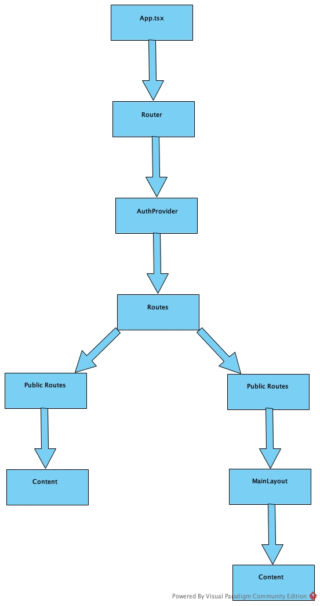

# Global Architecture - Immotep

---

**Purpose:**  
This architecture documentation serves as a comprehensive guide for developers working on the Immotep web application. It outlines the system's structure, design patterns, and implementation details to ensure consistent development practices and maintainable code.

## Overview

Immotep is a modern web application built with React and TypeScript, following a modular and scalable architecture. This documentation provides a comprehensive overview of the application's structure and its main components.

---

## Project Structure

```
src/
├── assets/          # Static resources (images, fonts, etc.)
├── components/      # Reusable components
│   ├── common/     # Common components
│   ├── features/   # Feature-specific components
│   ├── layout/     # Layout components
│   └── ui/         # UI components
├── context/        # Global state management (Context API)
├── enums/          # TypeScript enumerations
├── hooks/          # Custom hooks
├── interfaces/     # TypeScript types and interfaces
├── services/       # Services and API
├── translation/    # Translation files (i18n)
├── utils/          # Utilities and helpers
└── views/          # Main application pages
```

---

## Application Flow

  
*Figure: Keyz web architecture.*

---

## Data Flows

For a detailed description of data flows in the application, please refer to [Data Flows](./data-flows/data-flows.md). This document explains the interactions between different components, state management, and data flows between the frontend and backend.

---

## Core Components

### 1. Entry Point (`main.tsx`)
- React application initialization
- Global providers configuration
- Application mounting point

### 2. Application (`App.tsx`)
- Router configuration
- Public and protected routes management
- Main application structure

### 3. Main Layout (`MainLayout`)
- Common structure for authenticated pages
- Navigation management
- Content organization

---

## State Management

### Context API
- `AuthContext`: Authentication state management
- `PropertyContext`: Real property data management

---

## Routing

### Public Routes
- Login
- Register
- Forgot Password
- Success pages

### Protected Routes
- Overview
- Real Property
- Messages
- Settings
- Property details
- Damage details

---

## Security

- Route protection with `ProtectedRoute`
- JWT token management
- Session validation

---

## Internationalization

- Multi-language support with i18n
- Translation files in `translation/` directory

---

## Key Dependencies

### Core Framework
- React 18 - Main UI library
- TypeScript 5 - Type safety and development experience
- Vite 5 - Build tool and development server

### Routing & Navigation
- React Router - Client-side routing
- React Helmet Async - Document head management

### State Management & Data
- Context API - Built-in React state management
- Axios - HTTP client for API requests
- IDB - IndexedDB wrapper for offline storage

### UI Components
- Ant Design 5 - UI component library
- React Grid Layout - Grid system

### Internationalization
- i18next - Internationalization framework
- React i18next - React bindings for i18next

### Development Tools
- ESLint - Code linting
- Jest - Testing framework
- Prettier - Code formatting

---

## Extension Points

The architecture is designed to be extensible:
- Easy addition of new features
- Integration of new services
- Support for future functionalities
