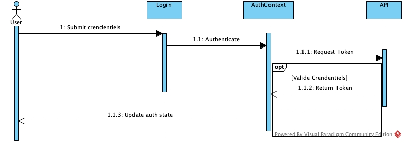
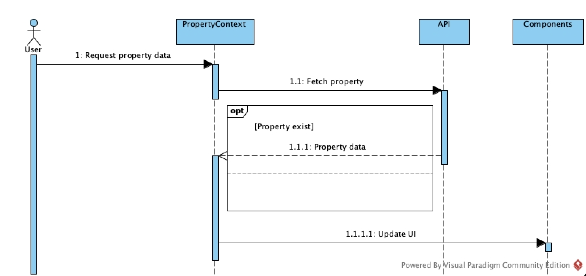

# Data Flows

---

**Purpose:**  
This section documents the main data flows within the Keyz web application, illustrating how data moves between different components and services. Understanding these flows is crucial for maintaining and extending the application's functionality.

---

## Authentication Data Flow

This diagram shows the authentication process, from credential submission to token management and state update.

---

## Property Data Flow

This diagram illustrates how property data is requested by the user, fetched via the PropertyContext, and updated in the UI.
