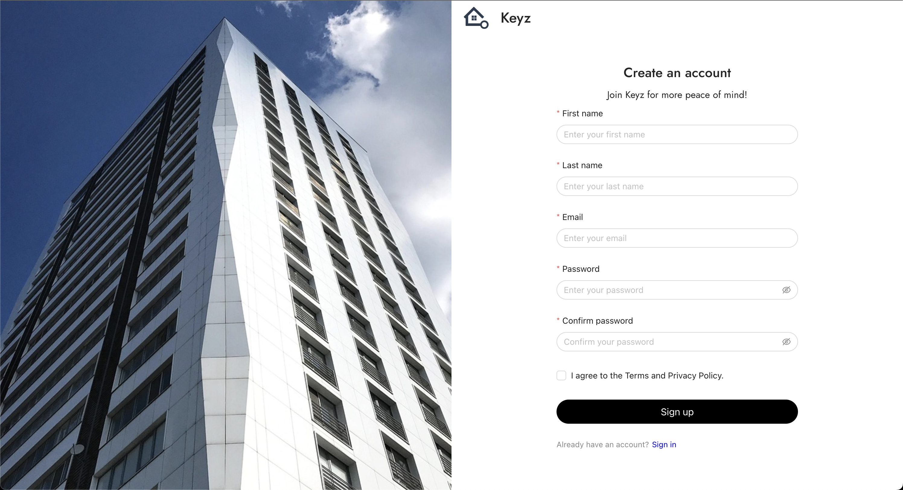
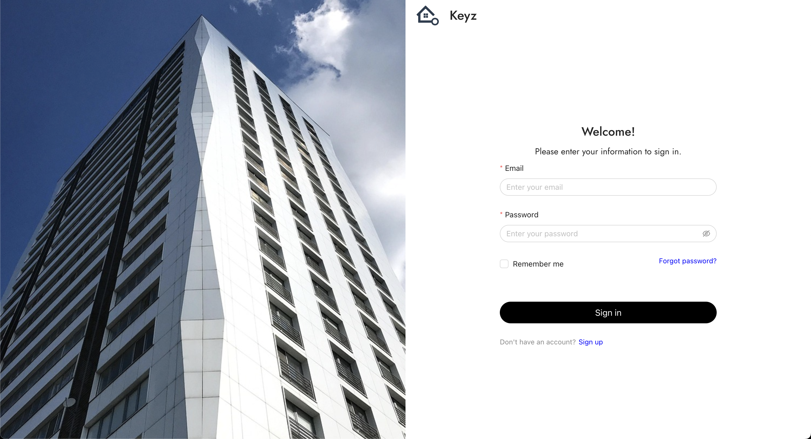

# Tenant authentification

## *Login or Register to your Keyz Account*

---

**Purpose:**  
The login and Register page allows users to access their accounts.

> 💡 **Note:**  
> In order to create an account, you must receive an invitation from an owner inviting you to one of these apartments.

---

*Figure: Keyz email to create an account.*

---

## **Steps to Register:**

*Figure: Keyz register form.*

1. **First Name**: Enter your first name in the corresponding field.  
2. **Last Name**: Enter your last name in the designated field.  
3. **Email**: Provide a valid email address.  
4. **Password**: Create a secure password with at least 8 characters. *(A visual indicator may help to show if the password is hidden.)*  
5. **Confirm Password**: Re-enter your password to confirm it.  
6. **Accept Terms**: Check the box to accept the terms, privacy policy, and fees.  
7. **Register**: Click the **Register** button to validate your registration. You will be redirected to the login page.

---

## **Steps to Log In:**

*Figure: Keyz login to an account.*

1. **Email**: Enter the email address used during registration.  
2. **Password**: Enter the password associated with your account.  
3. **Remember Me**: *(Optional)* Check this box to remember your session.  
4. **Log In**: Click the **Log In** button to access your account.  

---

## **Common Errors:**

- **Incorrect email or password:**  
  An error message will be displayed. Ensure you are using the correct information.

---

## **Security Management:**

- If you check **Remember Me**, your session information will be stored securely, and you will remain logged in.  
- Upon logout, all session information will be removed, ensuring the security of your account.