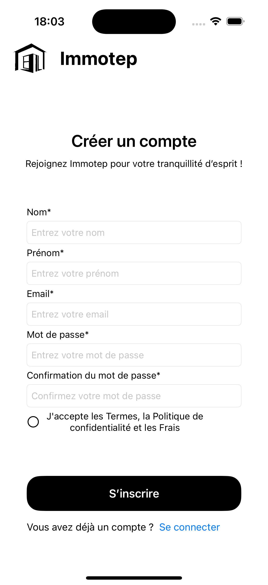
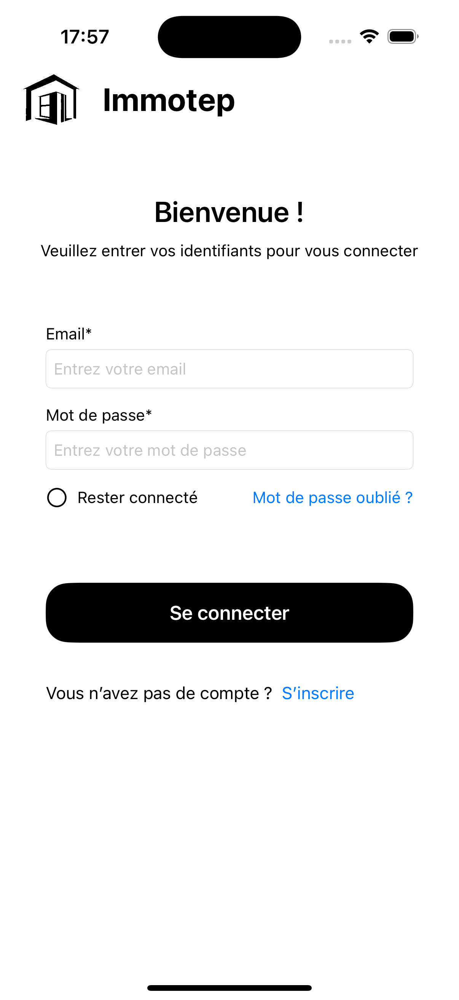

# User Documentation: Authentication

## Table of Contents

1. [Registration Page](#registration-page)
2. [Login Page](#login-page)

---

## Registration Page

### Purpose:

The registration page allows new users to create an account by providing the necessary information.

### Steps to Register:

1. **First Name**: Enter your first name in the corresponding field.
2. **Last Name**: Enter your last name in the designated field.
3. **Email**: Provide a valid email address.
4. **Password**: Create a secure password with at least 8 characters (a visual indicator may help you see if the password is hidden).
5. **Confirm Password**: Confirm your password by re-entering it.
6. **Accept Terms**: Check the box to accept the terms, privacy policy, and fees.
7. **Register**: Click the **Register** button to validate your registration and you will be redirect to the login page.

   > **Note:** If you already have an account, you can click the **Login** link at the bottom of the page.

### Common Errors:

- If the fields are incorrectly filled out or missing, error messages will be displayed.
- A valid email address is required, and it must not have been previously used to create an account in the app.
- The password and its confirmation must match to validate the registration.

---

## Login Page

### Purpose:

The login page allows existing users to access their accounts.

### Steps to Log In:

1. **Email**: Enter the email address used during registration.
2. **Password**: Enter your password associated with your account.
3. **Remember Me**: (Optional) Check this box to remember your session.
4. **Log In**: Click the **Log In** button to access your account.

   > **Note:** If you do not have an account yet, a **Register** link is available at the bottom of the page.

### Common Errors:

- If the email or password is incorrect, an error message will be displayed. Ensure you are using the correct information.
- If you have forgotten your password, use the reset option.

---

### Security Management:

- If you check **Remember Me**, your session information will be stored securely, and you will remain logged in.
- Upon logout, all session information will be removed, ensuring the security of your account.