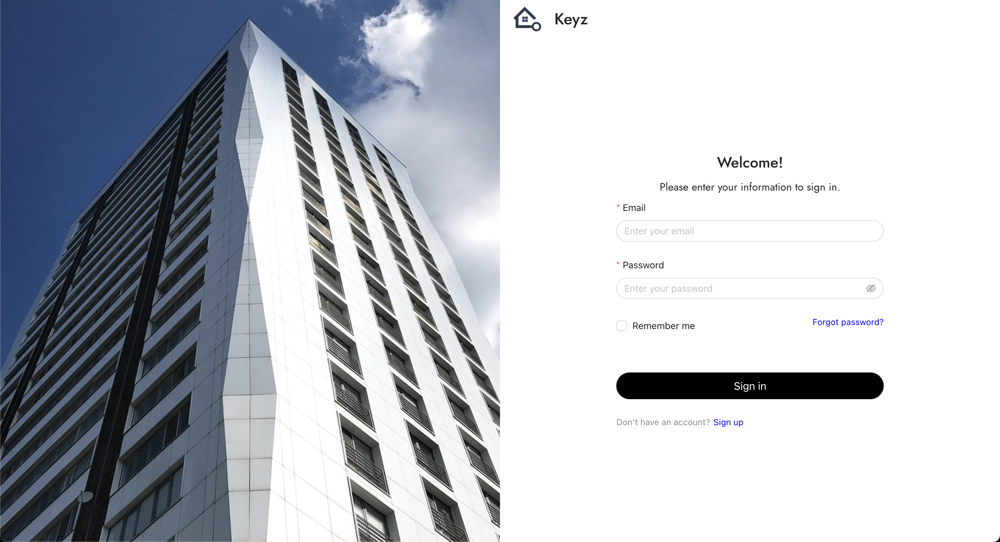

# Login

## Login to your Keyz Account

---

---

**Purpose:** The login page allows existing users to access their accounts.

---

**Steps to Log In:**

1. **Email**: Enter the email address used during registration.
2. **Password**: Enter your password associated with your account.
3. **Remember Me**: (Optional) Check this box to remember your session.
4. **Log In**: Click the **Log In** button to access your account.

   > **Note:** If you do not have an account yet, a **Register** link is available at the bottom of the page.

---

**Additional Features:**

- **Forgot Password**: If you have forgotten your password, click the **Forgot Password** link to initiate the recovery process.

---

**Common Errors:**

- If the email or password is incorrect, an error message will be displayed. Ensure you are using the correct information.
- If you have forgotten your password, use the reset option.

---

**Security Management:**

- If you check **Remember Me**, your session information will be stored securely, and you will remain logged in.
- Upon logout, all session information will be removed, ensuring the security of your account.
