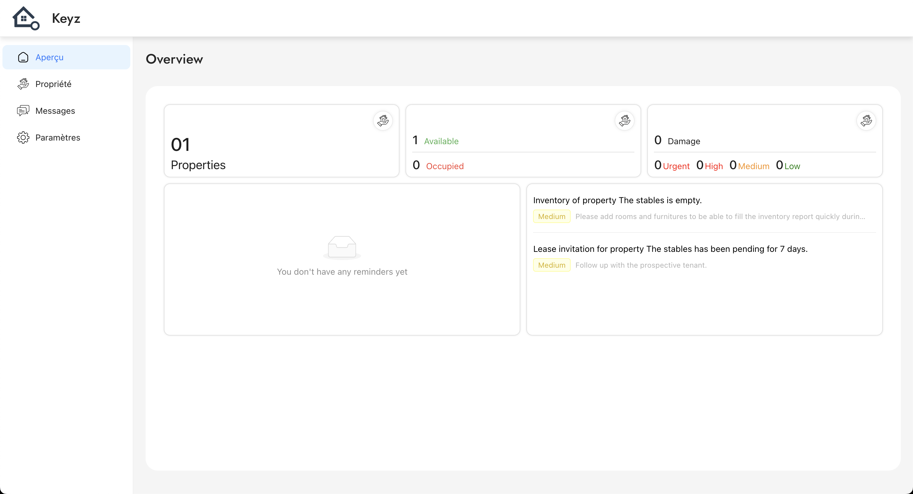

# Overview

## *Navigate through pages and view your data*

---

**Purpose:**  
The overview page gives you access to the various pages, as well as a summary of your data.

---

  
*Figure: Overview of Keyz application interface.*

---

# Sidebar Overview

The **Sidebar** allows easy navigation within the application, providing quick access to the main sections.

---

## Sections:

### **Overview**
- **Description** *(Quick summary of user data)*:  
  The overview provides a general summary of the application's features and user data at a glance.

### **Real Property**
- **Description** *(Manage your properties)*:  
  Navigate to the **Real Property** section to manage your properties. You can view, edit, and add new properties.

### **Messages**
- **Description** *(Manage conversations)*:  
  Access the **Messages** section to view and manage conversations. Stay in touch with your contacts and receive important updates.

### **Settings**
- **Description** *(Customize your experience)*:  
  The **Settings** section allows you to customize your preferences, manage account details, and configure the website.

---

## How to Use the Sidebar:
1. Click on any section to navigate to its page.
2. Use the **Overview** to return to the dashboard.
3. Manage your properties in the **Real Property** section.
4. Stay updated with new messages in the **Messages** section.
5. Adjust your preferences under **Settings**.

---

> 💡 **Note**:  
> The sidebar remains visible throughout the application for seamless navigation.
