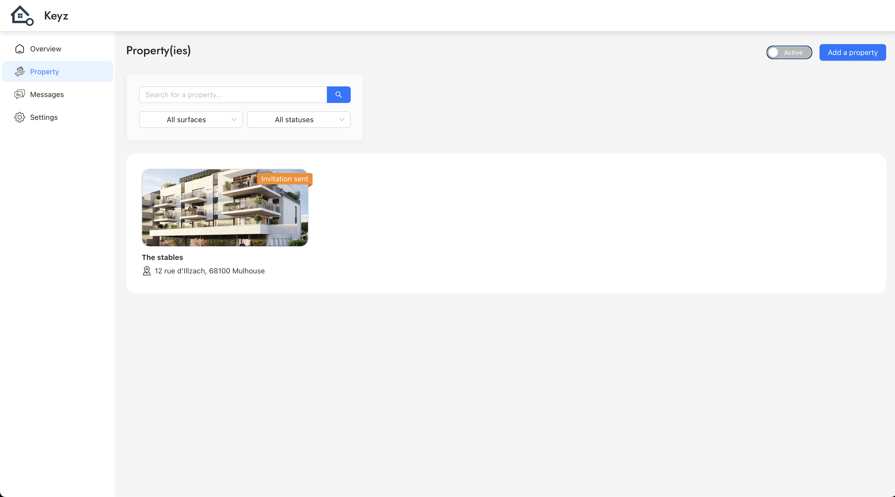

# Properties

## *Manage and View Your Properties*

---

**Purpose:**
The properties page allows property owners to manage and view all properties associated with their account. Users can filter, search, and navigate their properties efficiently.

---

*Figure: Properties management interface in the Keyz application.*

---

## **Features**

### **Property List**

* Displays all properties associated with the account.
* Provides key details, such as the property name, address, and current status (e.g., available, occupied, invitation sent).
* Shows a thumbnail image for each property for easy identification.

---

## **Filtering and Searching**

### **Search Bar**

* **Search by Name:** Allows users to search for properties by entering their name in the search field.

### **Filters**

* **By Surface Area:** Filter properties based on their surface area (e.g., all sizes, custom ranges).
* **By Status:** Filter properties by their current status:

  * **Available**: Properties ready for new tenants or buyers.
  * **Occupied**: Properties currently in use.
  * **Invitation Sent**: Properties awaiting confirmation from potential tenants or collaborators.

### **Deleted Properties**

* **Option to View Deleted Properties:** A toggle at the top-right corner allows users to include deleted properties in the list.

---

## **Actions**

1. **View Details:**

   * Click on any property to access detailed information and management options for that property.

2. **Add a Property:**

   * Use the **"Add a Property"** button at the top-right corner to create and list a new property.

3. **Toggle Active Properties:**

   * Use the **"Active"** switch to filter between active and deleted properties quickly.

---

## **Benefits**

* **Enhanced Organization:** Quickly access and manage all properties linked to the account.
* **Streamlined Navigation:** Use filters and search tools to find specific properties with ease.
* **Comprehensive View:** Keep track of available, occupied, and pending properties in one place.

---

> 💡 **Note:**
> Filters and search results update dynamically, ensuring accurate and up-to-date information for users.

---
