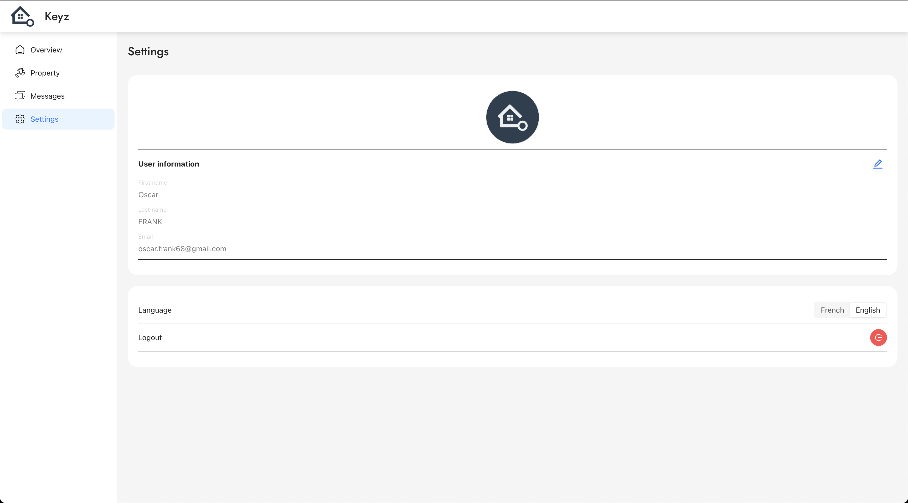

---

# Settings

## *Customize Your Keyz Experience*

---

**Purpose:**
The *Settings* page allows users to personalize their profile, adjust application preferences, and manage account actions.

---

*Figure: User settings interface in the Keyz application.*

---

## **Available Actions**

1. **Change Profile Picture**

   * Update your profile picture to personalize your account.
   * Click on your current picture or the placeholder image, then upload a new photo.

2. **Edit Name and Surname**

   * Update your first and last name directly from the settings page.
   * Ensure your information is accurate for identification purposes.

3. **Change Application Language**

   * Select your preferred language for the application interface.
   * Options include multiple supported languages to enhance usability.

4. **Log Out**

   * Securely log out of your account.
   * Use this feature to protect your data when accessing your account on shared devices.

---

## **How to Use the Settings Page**

1. Navigate to the *Settings* page via the sidebar.
2. Select the option you wish to update:

   * Click the profile picture to upload a new image.
   * Edit your name by clicking the text fields for your first and last name.
   * Use the dropdown menu to select a different language.
   * Click **Log Out** to end your session securely.

---

> 💡 **Tip:**
> Regularly update your profile picture and personal details to maintain a professional and accurate account representation.

---
