# KPI report

## 1. Developing and Retaining a User Community

### Brand Image and Online Presence

We have a visual identity that is consistent across all platforms, including our website, social media, and marketing materials.

Here is our **logo**:

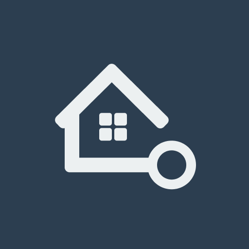

Here is our **color palette**:

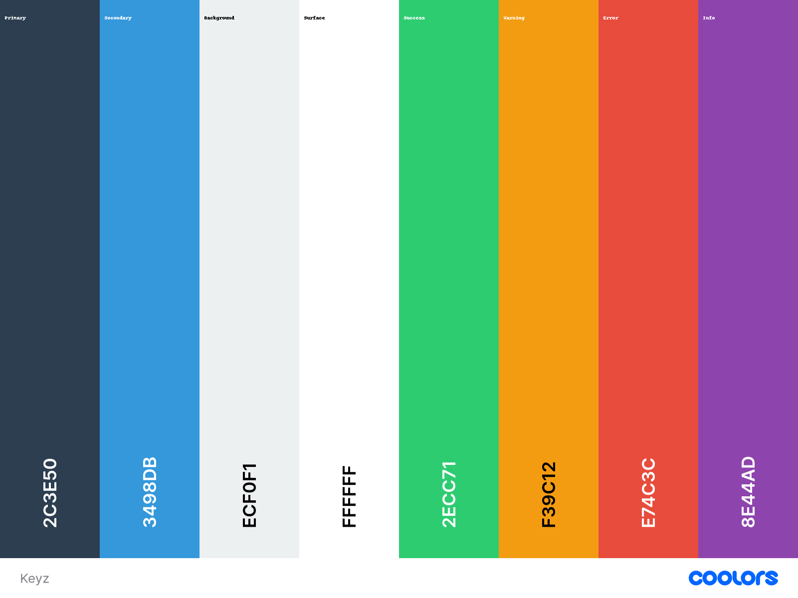

Here is our **typography**:

- App: [Jost](https://fonts.google.com/specimen/Jost)
- Social media: [Raleway](https://fonts.google.com/specimen/Raleway)

We also created **3 social media accounts** to engage with our community, and we are actively posting content on these platforms. You can find us on:

- [LinkedIn](https://www.linkedin.com/company/keyz-app/)
- [Instagram](https://www.instagram.com/app.keyz/)
- [Facebook](https://www.facebook.com/profile.php?id=61575702764536)

### Content Strategy

Our content strategy works by **posting content on every social media platform every week**, with a focus on engaging our audience and promoting our brand. We have built a content calendar that outlines the topics and themes for each post, ensuring that we cover a variety of subjects related to our app and the rental market.

We have planned our **editorial calendar for the next few weeks** to ensure a consistent flow of content that engages our audience and promotes our brand. Here is a summary of our planned content:

- May 7th, 2025: Introduction to Keyz
- May 14th, 2025: Presentation Keyz's main features for owners
- May 21st, 2025: Presentation Keyz's main features for tenants
- May 28th, 2025: Showcasing Keyz's landing page
- June 4th, 2025: Highlighting tenants' rights regarding the inventory report
- June 11th, 2025: 3 tips to do a successful inventory report without stress
- June 18th, 2025: Teasing Keyz's beta launch
- June 25th, 2025: Keyz's beta launch announcement and invitation to join the beta program
<!-- TODO: add other ideas -->

### Beta Tester Acquisition

We are actively **seeking beta testers** to help us refine our app and gather valuable feedback. We have created a contact form on our showcase website where interested users can sign up to become beta testers. As said just above, we are also promoting our beta program on our social media accounts to reach a wider audience and encourage more users to join.

We also contacted **2 people** in our network **who are engaged in the rental market**, such as real estate agents, property managers, and landlords, to invite them to participate in our beta program. They are really interested in our app and are eager to provide feedback on its features and usability.

We also created a **form** to collect **feedback from our beta testers**. This form allows them to share their thoughts on the app's functionality, usability, and overall experience. We are using this feedback to make improvements and ensure that Keyz meets the needs of our users. The form is available on our showcase website and at this link: [Feedback form](https://forms.office.com/e/awST3YANi4).

Each user who helps us by testing our app and providing feedback will receive a **free 1-year subscription** to Keyz when it is launched. This is our way of thanking them for their valuable contributions and encouraging them to continue using our app in the future.

## 2. Working on User Experience (UX/UI)

### User-Centered Design

???

### High-Quality Prototyping

We produced an intuitive and visually appealing product to ease the user journey. Modern UI/UX design principles like **responsive design**, **simplicity** and **accessibility** were applied (see below).

Clean, simple and modern design:
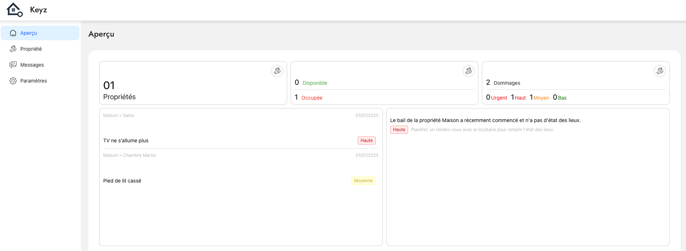
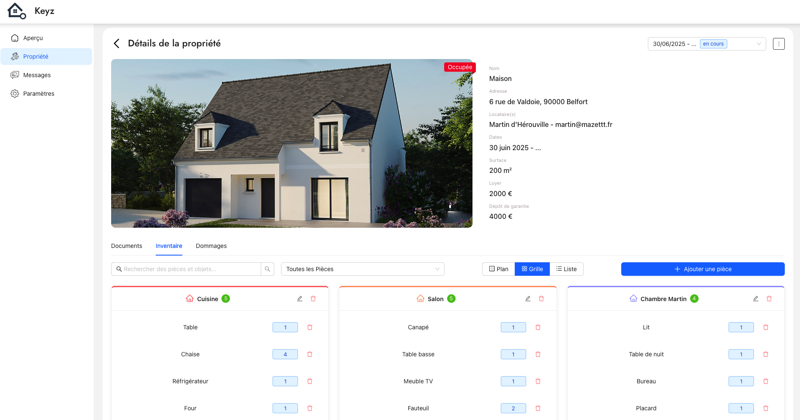

    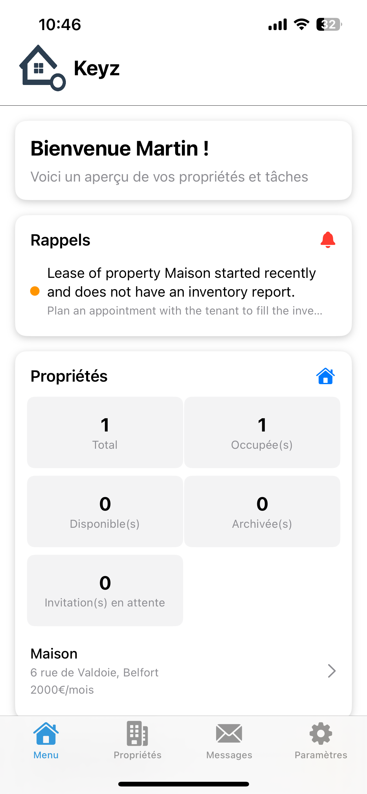
    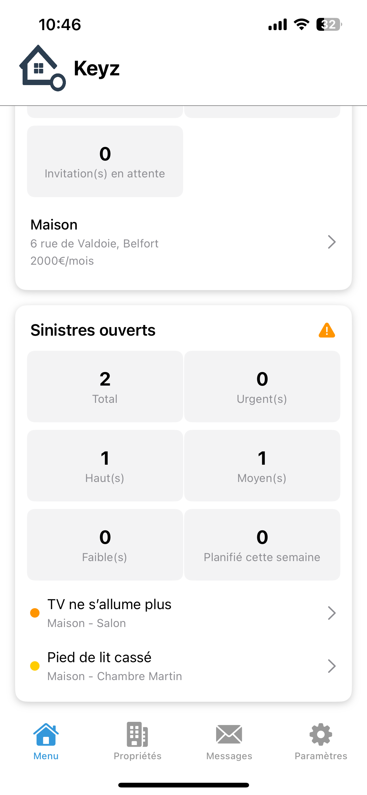

    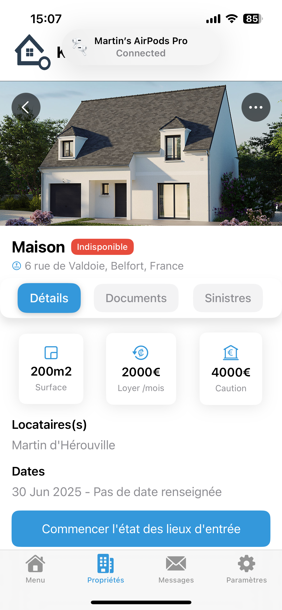
    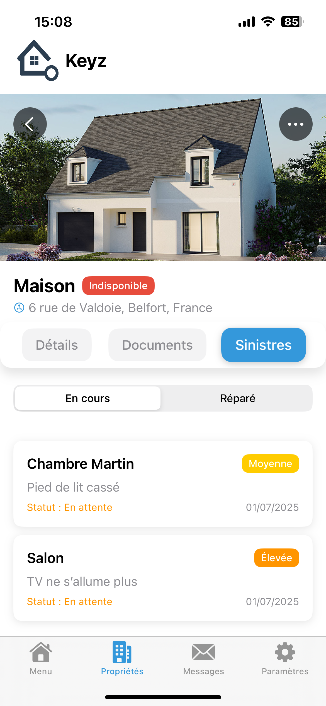

Responsiveness (screenshots of the web app taken on an iPhone 13):

    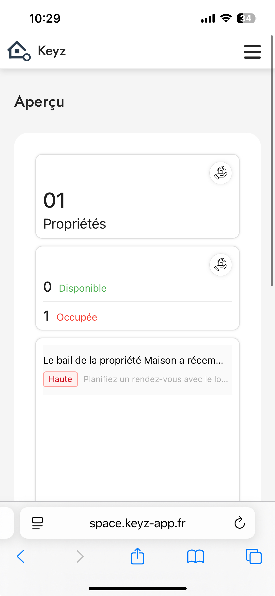
    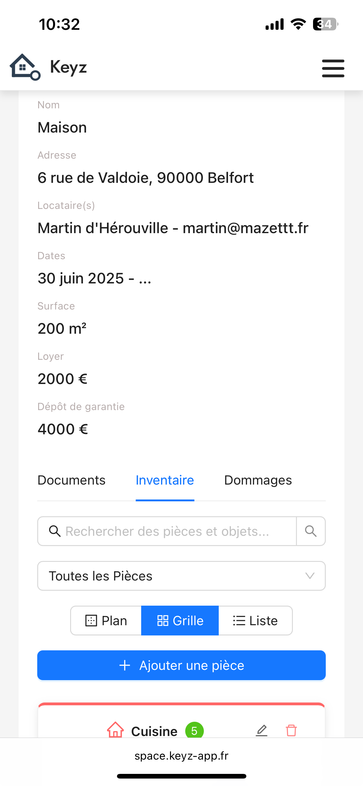

Accessibility:

???

### Seamless Experience

Navigation is really fast and straightforward, with a clear and intuitive layout. Loading times are minimized with a mechanism that **loads only necessary**, small and relevant data first. Then, a lazy loading mechanism loads big data such as images, ensuring that users can quickly access the information they need without unnecessary delays.

A clear **user documentation** covering 100% of available features is available explaining how to use each feature of the app. It includes step-by-step instructions, screenshots, and tips to help users navigate the app effectively. The documentation is available here: [User documentation](https://github.com/Keyz-EIP/Keyz/tree/main/Documentations/User).

## 3. Increasing Visibility and Impact on Social Media

### Optimized Content Strategy

Our content strategy is designed to maximize engagement and reach on social media platforms. We **post content every week on different days and times** depending on the platform, to reach the optimal time for our target audience:

- **LinkedIn**: Tuesdays at 10:30 AM.
- **Instagram**: Wednesdays at 7 AM.
- **Facebook**: Wednesdays at 12:30 PM.

Each post includes **hashtags** relevant to the rental market and our app. We post a variety of content, including **teasers**, **feature presentations**, and **tips** related to the rental market.

Here are some examples of our posts:

    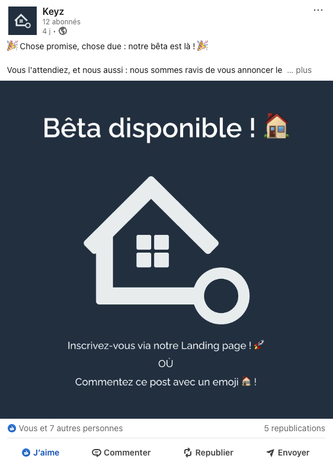
    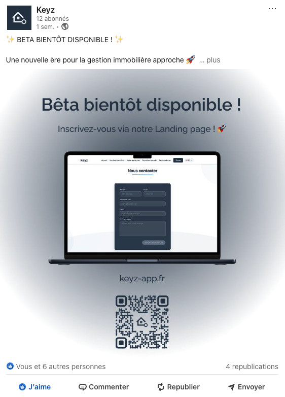

    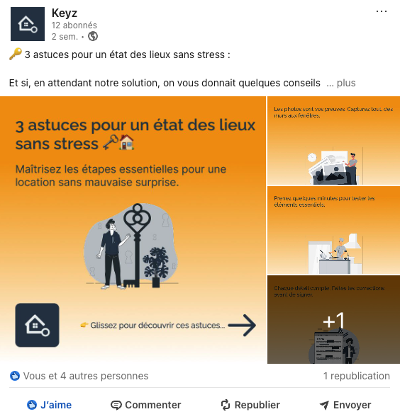
    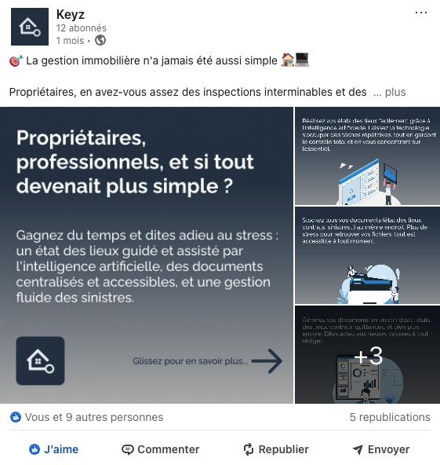

### Ongoing Training

First of all, we built a **showcase website** to present our app and its features. This website serves as a central hub for information about Keyz, including its benefits, features, pricing, how to get started, and a contact form. The website is available here: [Keyz showcase website](https://keyz-app.fr).

We set up **Google Analytics** to track user behavior on our showcase website and within the app. This tool provides us with valuable insights into how users interact with our site, which pages they visit, and how long they stay. This data helps us understand our audience better and will determine our future content strategy and app improvements. We also use **Meta Business Suite** to manage Instagram and Facebook and track engagement metrics such as likes, shares, and comments.

Also, all our social media contents (including presentation designs and video edits for posts) are created using **Canva** and **Figma**, which are powerful design tools that allow us to create visually appealing and engaging content. We use Canva for creating graphics, infographics, and social media posts, while Figma is used for designing the app's user interface and prototypes.

## 4. Optimizing Relationships with the Target Audience

### Community Engagement

We aim to build trust and transparency with our target customers through social media, using **polls** and **surveys** to gather insights easily, but also by engaging with them through **comments** and **direct messages**. We respond to all comments and messages promptly, ensuring that our audience feels heard and valued.

Our new **features releases** are always announced on our social media accounts, ensuring that our audience is informed about the latest updates and improvements to the app.

We also publish each release on our **GitHub repository** with detailed release notes and version number, which include information about new features, bug fixes, and improvements. This transparency helps build trust with our users and keeps them engaged with our app. Releases are available here: [Keyz GitHub releases](https://github.com/Keyz-EIP/Keyz/releases).

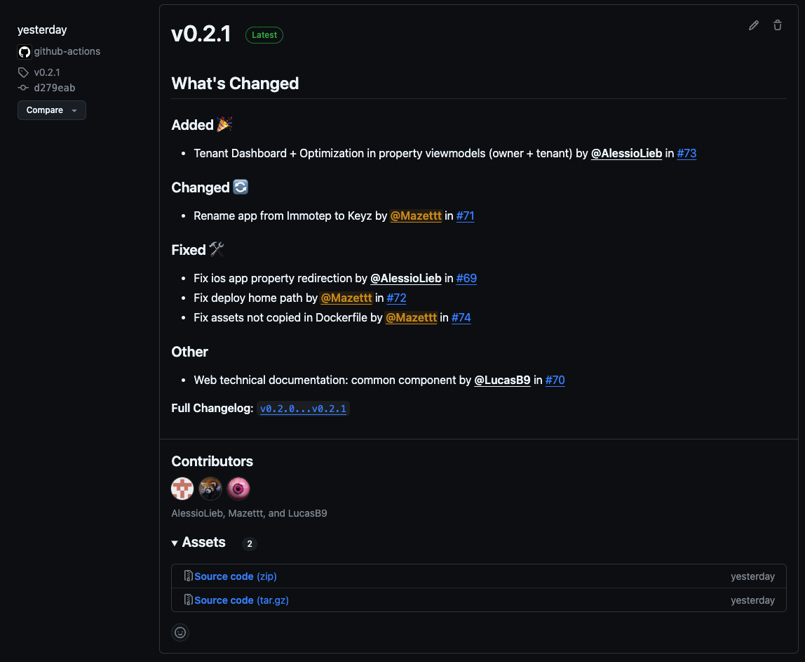

### Feedback System

As said earlier in [Beta Tester Acquisition section](#beta-tester-acquisition), we created a **form** to gather feedback and suggestions from our beta testers.

We also created a second **form** to collect real statistics about app usage and user behavior, especially for the mobile application. This form contains a lot of questions about the user's experience, such as how often they use the app, which features they find most useful, and any issues they encounter. This data will help us understand how users interact with Keyz and identify areas for improvement. The form is available here: [Usage statistics form](https://forms.office.com/e/tw5JqqLNg1).

There is also a **contact form** on our showcase website where users can reach out to us with any questions, concerns, or feedback they may have. The contact form is available here: [Contact form](https://keyz-app.fr/#contact-us) and sends an email to `contact@keyz-app.fr`, where users can also reach us directly.

After launch, we will also create a **Trustpilot** page to gather and respond to user feedback.

> No matter what method users choose to contact us, we will answer them quickly and ensure a follow-up to address their concerns and feedback.

### Satisfaction Metrics

<!-- TODO after receiving user feedback -->
