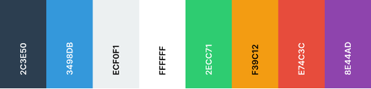

# KPI report

## 1. Developing and Retaining a User Community

### Brand Image and Online Presence

#### Redesign

First of all, we completely redesigned our **brand image** name and logo. At the beginning, our name was **Immotep**, which was more like a student's project name and not really suitable for a professional app. We wanted a name that would resonate with our target audience and reflect the purpose of our app, which is to simplify property management for both landlords and tenants.

We chose the name **Keyz** to represent our app, as it symbolizes access and control over properties. The name is short, memorable, and easy to pronounce, making it suitable for our target audience.

We also created a new **logo** that reflects our brand identity. The logo features a key and a house, symbolizing the connection between landlords and tenants in property management. The design is modern and simple, making it visually appealing and easy to recognize.

#### Visual Identity

We have a visual identity that is consistent across all platforms, including our website, social media, and marketing materials.

The **tone** we are using is formal and polite, as the target audience is often over **35 years old**.

Here is our **logo**:

Here is our **color palette**:

Here is our **typography**:

[Jost](https://fonts.google.com/specimen/Jost)

We also created **3 social media accounts** to engage with our community, and we are actively posting content on these platforms. You can find us on:

- [LinkedIn](https://www.linkedin.com/company/keyz-app/)
- [Instagram](https://www.instagram.com/app.keyz/)
- [Facebook](https://www.facebook.com/profile.php?id=61575702764536)

### Content Strategy

Our content strategy works by **posting content on every social media platform every week**, with a focus on engaging our audience and promoting our brand. We have built a content calendar that outlines the topics and themes for each post, ensuring that we cover a variety of subjects related to our app and the rental market.

When we started posting content on social medias, we planned our **editorial calendar for the following months** to ensure a consistent flow of content. Here is a summary of our planned content:

- May 6th, 2025: Project teaser: make property management easier
- May 14th, 2025: Presentation main features for landlords
- May 21st, 2025: Presentation main features for tenants
- May 28th, 2025: Landing page announcement
- June 5th, 2025: 5 tenants rights during a property inspection
- June 11th, 2025: 3 practical tips for a stress-free property inspection
- June 18th, 2025: Beta release teaser
- June 26th, 2025: Beta launch announcement with invitation to join the beta program + free access for early users
- July 08, 2025: Ask me anything
- July 15th, 2025: Beta user testimonial (owner)
- July 22nd, 2025: Educational post: “Why property inspections often lead to disputes”
- July 29th, 2025: Feature spotlight (e.g. inventory)
- August 05th, 2025: 30-second demo video of the app in action
- August 12th, 2025: Beta FAQ: answering common questions
- August 19th, 2025: Reminder: Beta access still available & free

### Beta Tester Acquisition

We are actively **seeking beta testers** to help us refine our app and gather valuable feedback. We have created a **contact form on our showcase website** where interested users can sign up to become beta testers. As said just above, we are also promoting our beta program on our social media accounts to reach a wider audience and encourage more users to join.

We also contacted **3 people** in our network **who are engaged in the rental market**, such as real estate agents, property managers, and landlords, to invite them to participate in our beta program. They are really interested in our app and are eager to provide feedback on its features and usability.

Each user who helps us by testing our app and providing feedback will receive a **free 1-year subscription** to Keyz when it is launched. This is our way of thanking them for their valuable contributions and encouraging them to continue using our app in the future.

## 2. Working on User Experience (UX/UI)

### User-Centered Design

First, we created **mock-ups** of our app using **Figma**. These mock-ups allowed us to visualize the user interface and user experience before starting the development process. We designed the app with a focus on simplicity, ease of use, and accessibility, ensuring that users can navigate through the app without any difficulties.

Both the web and mobile mock-ups were designed with a **unified visual identity**, ensuring that our app delivers a **consistent** look and feel across all platforms.

When our mock-ups were ready, we asked some potential users if the UX seemed comprehensive and effective. First of all, feedbacks were not really positive, as they found the mock-ups **not modern enough** and not really appealing. We then decided to **redesign the mock-ups** to make them more visually appealing and user-friendly. We applied modern UI/UX design principles, such as responsive design, simplicity, and accessibility, to create a more intuitive and engaging user experience.

On both screenshots below, you can see the two versions of our mock-ups, the first one (V1, Immotep) being the initial version and the second one (V2, Keyz) being the redesigned version:

### High-Quality Prototyping

We produced an intuitive and visually appealing product to ease the user journey. Modern UI/UX design principles like **responsive design**, **simplicity** and **accessibility** were applied (see below).

Clean, simple and modern design:

    
    

    
    

Responsiveness (screenshots of the web app taken on an iPhone 13):

    
    

Accessibility:

Each front-end application (web and mobile) is designed to be accessible to all users, including those with disabilities. We follow the **Web Content Accessibility Guidelines (WCAG)** to ensure that our app is usable by everyone. This includes:
- Visual accessibility features
    - Use of sufficient contrast between text and backgrounds to ensure readability.
    - Support of screen readers with correct semantic structuring of elements (titles, buttons, forms) with appropriate tags (ARIA on the web, native accessible components on mobile) as well as alternative text for images.
    
    - Support for user zoom or custom text sizes on operating systems.
- Motor accessibility
    - Mouse-free navigation: All webapp actions can be performed using the keyboard only.
    
    - Sufficient size and spacing of clickable elements on mobile devices for people with motor impairments.
    - Support for assistive technologies such as voice commands (VoiceOver, TalkBack).
    
- Cognitive accessibility
    - Clean, intuitive interface with simple navigation, clear icons and self-explanatory labels.
    - Presentation of information in several formats (text + pictograms).

We also implemented **dark mode** in our mobile app, which is a popular feature that reduces eye strain and improves readability in low-light conditions. Users can easily switch between light and dark modes in the app settings.

### Seamless Experience

Navigation is really fast and straightforward, with a clear and intuitive layout. Loading times are minimized with a mechanism that **loads only necessary**, small and relevant data first. Then, a lazy loading mechanism loads big data such as images, ensuring that users can quickly access the information they need without unnecessary delays.

A clear **user documentation** covering 100% of available features is available explaining how to use each feature of the app. It includes step-by-step instructions, screenshots, and tips to help users navigate the app effectively. The documentation is available here: [User documentation](https://github.com/Keyz-EIP/Keyz/tree/main/Documentations/User).

## 3. Increasing Visibility and Impact on Social Media

### Optimized Content Strategy

Our content strategy is designed to maximize engagement and reach on social media platforms. We **post content every week on different days and times** depending on the platform, to reach the optimal time for our target audience:

- **LinkedIn**: Tuesdays at 10:30 AM.
- **Instagram**: Wednesdays at 7 AM.
- **Facebook**: Wednesdays at 12:30 PM.

Each post includes **hashtags** relevant to the rental market and our app. We post a variety of content, including **teasers**, **feature presentations**, and **tips** related to the rental market.

Here are some examples of our posts:

    
    

    
    

### Ongoing Training

First of all, we built a **showcase website** to present our app and its features. This website serves as a central hub for information about Keyz, including its benefits, features, pricing, how to get started, and a contact form. The website is available here: [Keyz showcase website](https://keyz-app.fr).

We set up **Google Analytics** to track user behavior on our showcase website and within the app. This tool provides us with valuable insights into how users interact with our site, which pages they visit, and how long they stay. This data helps us understand our audience better and will determine our future content strategy and app improvements. We also use **Meta Business Suite** to manage Instagram and Facebook and track engagement metrics such as likes, shares, comments and times when our audience is most active.

Also, all our social media contents (including presentation designs and video edits for posts) are created using **Canva** and **Figma**, which are powerful design tools that allow us to create visually appealing and engaging content. We use Canva for creating graphics, infographics, and social media posts, while Figma is used for designing the app's user interface and prototypes.

Here is our Figma file containing the logo design and the social media posts we created:

### Metrics

Here are the current metrics gathered from our social media accounts:

| Platform   | Followers |
|------------|-----------|
| LinkedIn   | 13        |
| Instagram  | 31        |
| Facebook   | 7         |

#### LinkedIn

Overview:

    
    <!--  -->
    
    
    

By posts:

    
    
    
    
    
    
    
    

#### Instagram

Overview:

<table>
    <tr>
        <td>
             
            
        </td>
        <td>
            
        </td>
    </tr>
</table>

By posts:

    

#### Facebook

Overview:

#### Summary

Overall, our social media presence is growing thanks to our consistent posting schedule and engaging content. We can see that statistics are improving week after week, with more followers and engagement on our posts due to our posting strategy.

## 4. Optimizing Relationships with the Target Audience

### Community Engagement

We aim to build trust and transparency with our target customers through social media, using **polls** and **surveys** to gather insights easily, but also by engaging with them through **comments** and **direct messages**. We respond to all comments and messages promptly, ensuring that our audience feels heard and valued. We made a post asking our audience to ask us anything about the app.

We publish each release on our **GitHub repository** with detailed release notes and version number, which include information about new features, bug fixes, and improvements. This transparency helps build trust with our users and keeps them engaged with our app. Releases are available here: [Keyz GitHub releases](https://github.com/Keyz-EIP/Keyz/releases).

In the future, we aim to post regular updates on our social media accounts as well to keep our audience informed about new features, improvements, and upcoming releases. We will also share success stories and testimonials from our beta testers to showcase the value of Keyz.

### Feedback System

We created a **form** to collect **feedback from our beta testers**. This form allows them to share their thoughts on the app's functionality, usability, and overall experience. We are using this feedback to make improvements and ensure that Keyz meets the needs of our users. The form is available on our showcase website and at this link: [Feedback form](https://forms.office.com/e/awST3YANi4).

We also created a second **form** to collect real statistics about app usage and user behavior, especially for the mobile application. This form contains a lot of questions about the user's experience, such as how often they use the app, which features they find most useful, and any issues they encounter. This data will help us understand how users interact with Keyz and identify areas for improvement. The form is available here: [Usage statistics form](https://forms.office.com/e/tw5JqqLNg1).

There is also a **contact form** on our showcase website where users can reach out to us with any questions, concerns, or feedback they may have. The contact form is available here: [Contact form](https://keyz-app.fr/#contact-us) and sends an email to `contact@keyz-app.fr`, where users can also reach us directly.

After launch, we will also create a **Trustpilot** page to gather and respond to user feedback.

> No matter what method users choose to contact us, we will answer them quickly and ensure a follow-up to address their concerns and feedback.

### Satisfaction Metrics

<!-- TODO: put calculation metrics after receiving user feedback -->
